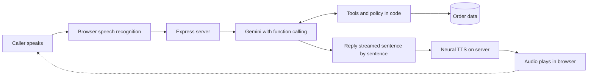

# Aria: AI Voice Support Agent for Aura Skincare

A browser-based voice customer support agent. Click **Start call**, speak, and Aria answers out loud, looks up live order data through tool calls, enforces brand policy, and writes a transcript and structured summary when the call ends.


**Live demo:** https://aria-ai-voice-support-agent.onrender.com/

> Use **Chrome or Edge** (the Web Speech API is needed for the microphone) and allow microphone access. If the demo is hosted on a free tier, the first load can take a little while to wake up.

<!-- Add screenshots or a short demo GIF here, for example:


-->

---

## Features

### Voice experience
- Natural voice conversation: browser speech recognition in, a free neural female Indian voice out (Microsoft Neerja for English, Swara for Hinglish) generated on the server, with the browser voice as automatic fallback
- English and Hinglish call modes
- Barge-in with an **Interrupt** button, and typing as a fallback to the microphone
- Graceful handling of silence, unclear audio, and out-of-scope requests

### Smart support logic
- Four tools called by the LLM: `get_order_details`, `check_return_eligibility`, `cancel_order`, `get_shipping_quote`
- Policy enforced **in code**, not only in the prompt, so it cannot be talked around: return window, opened products, cancellation only while the order is Processing, and cancellation needs explicit confirmation
- Graceful handling of invalid or missing order IDs

### Live feedback
- Live order tracker that updates when an order is cancelled, plus a one-click demo reset
- Tool activity shown in the transcript, with time to first words per turn
- Low latency: the model's reply is streamed and spoken sentence by sentence, with model thinking minimised

### After the call
- Full transcript and a structured JSON summary, both downloadable

---

## Architecture



Each stage can be swapped independently. The server keeps the API key private and owns the order data and policy logic, while the model only decides **when** it needs data.

### Tools

| Tool | What it does |
|---|---|
| `get_order_details` | Looks up status, courier, and delivery estimate for an order |
| `check_return_eligibility` | Applies the return window and opened-product rules |
| `cancel_order` | Cancels only while Processing, and only after the caller confirms |
| `get_shipping_quote` | Returns the shipping fee for an order value |

---

## Tech stack

| Area | Tools |
|---|---|
| Client | React, Vite |
| Server | Node.js, Express, `cors`, `dotenv` |
| LLM | Google Gemini with function calling |
| Speech in | Browser Web Speech API |
| Speech out | `msedge-tts` neural voices, browser voice as fallback |
| Hosting | Render (single web service) |

---

## Getting started

Requires Node 18 or newer, and Chrome or Edge.

```bash
# 1. Install
npm install                  # server deps
npm install --prefix client  # client deps

# 2. Configure
cp .env.example .env         # then add your GEMINI_API_KEY

# 3. Run (two terminals)
node server/index.js         # API on :3001
cd client && npm run dev     # UI on :5173
```

If your Vite dev server does not already proxy `/api`, add this to `client/vite.config.js`:

```js
server: { proxy: { '/api': 'http://localhost:3001' } }
```

### Environment variables

| Variable | Required | Purpose |
|---|---|---|
| `GEMINI_API_KEY` | Yes | Gemini API key, kept on the server |
| `MODEL` | No | Override the Gemini model |
| `THINKING_LEVEL` | No | Tune model thinking for speed vs. depth |

> Never commit `.env`. It is listed in `.gitignore`.

---

## Deploy on Render (single web service)

- **Build command:** `npm install && npm install --prefix client && npm run build --prefix client`
- **Start command:** `node server/index.js`
- **Environment variables:** `GEMINI_API_KEY`, and optionally `MODEL` and `THINKING_LEVEL`
- Microphone access needs HTTPS, which Render provides.

---

## Test script for evaluators

| Say | Expected |
|---|---|
| "Where is ORD-101?" | Out for delivery with BlueDart, expected by 6 PM |
| "Can I return ORD-102?" | Declined: delivered 14 days ago, outside the 7-day window |
| "Cancel ORD-103" | Asks to confirm, cancels after "yes", tracker shows Cancelled |
| "Cancel ORD-101" | Declined: already out for delivery, may refuse at the doorstep |
| "Where is ORD-999?" | Could not locate it, asks to verify |
| "Will I pay shipping on a 450 rupee order?" | Yes, Rs 50 fee |
| "Book me a flight to Goa" | Politely declines, only Aura Skincare queries |

---

---

## Roadmap

- [ ] Streaming speech recognition and voice activity detection for automatic barge-in
- [ ] Production-grade TTS option
- [ ] Automated adversarial call tests on every change
- [ ] Caller verification and a real order service in place of the mock data
- [ ] Human handoff path for unresolved calls

---

## Author
Built by Nikita (@nikita-rathod654).
